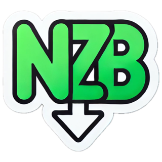
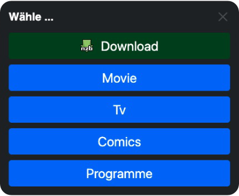

<div align="center" style="display: flex; align-items: center; justify-content: center;">
    
    <h1>NZBLink-to-Download UserScript</h1>
</div>

### Beschreibung
Mit diesem UserScript kannst du NZB-Dateien direkt von nzbindex.nl runterladen, sobald du auf Links klickst, die mit dem "nzblnk:" Schema erstellt wurden.
Es wurde speziell für die Safari-Erweiterung [Userscripts](#userscripts) erstellt, sollte jedoch auch mit Tampermonkey kompatibel sein.

### UserScripts

**Anmerkung**: Die Userscripts Erweiterung ist für Safari am Mac, iPad und iPhone verfügbar.

- AppStore: https://apps.apple.com/us/app/userscripts/id1463298887
- GitHub: https://github.com/quoid/userscripts

### Funktionen
- Erkennt automatisch Links mit dem Schema "nzblnk:"
- Wandelt "nzblnk:" Links um und ermöglicht den direkten Download der NZB von nzbindex.nl
- Bennent Datei im üblichen NAME{{PASSWORT}}.nzb format
- Auswahl der Kategorie bei SABnzbd

### Einstellungen 

#### Ausgabe: 

| Wert         | Beschreibung                                                                                                    |
|--------------|-----------------------------------------------------------------------------------------------------------------|
| URLtoSABnzbd | Die NZB-URL wird an SABnzbd weitergeleitet, NZB wird von SABnzbd geladen.                                       |
| NZBtoSABnzbd | Die NZB direkt wird an SABnzbd weitergleitet, funktioniert nicht bei Safari                                     |
| download     | Die NZB wird in deinem Download Ordner gespeichert                                                              |
| menu         | Öffnet ein Menu in dem man manuell auswählen kann ob die Nzb an Sab gesendet wird oder gedownloaded werden soll |

**Für SABnzbd**

```js
const SAB_API_KEY = '...'; // required
const SAB_URL = 'http://localhost:8080/sabnzbd/api'; // required z.B. 'http://localhost:8080/sabnzbd/api'

// leer lassen, um sie direkt von SABnzbd zu holen / hierzu den api-key und nicht den nzb-key verwenden!
const SAB_CATEGORIES = []  

// SABnzbd Kategorie Auswahl
const SAB_DEFAULT_CATEGORY = '*' // default: *
// Sab Buttons als Untermenü -> wird empfohlen, wenn viele Kategorien vorhanden sind
const SAB_SUB_MENU = false // default: false
```

> Wenn keine Kategorien in SAB_CATEGORIES hinterlegt sind, werden diese von SAB automatisch bezogen dafür wird der Einsatz des API-Keys erforderlich, da der NZB-Key nicht ausreichend Berechtigungen hat.
> Für eine höhere Sicherheit, aber etwas weniger Komfort, wäre dies die bessere Wahl.
> Zusätzlich spart man sich die extra Anfrage an Sab, um die Kategorien zu laden.

### Menu Ausgabe

<center>

</center>

Das neue Menu ersetzt die alte Kategorie Auswahl. Ist jedoch deutlich flexibler und bietet mehr Möglichkeiten.
Zum Beispiel kannst du nun neben SABnzbd auch denn Download einer NZB-Datei auswählen.
Wenn du sehr viele Kategorien hast, wird empfohlen die Option **SAB_SUB_MENU** zu aktivieren, dann werden die ganzen Kategorien in ein Untermenü gepackt.


### Installation

**Für Userscripts (Safari Erweiterung):**
1. Installieren Sie die [Userscripts](https://github.com/quoid/userscripts) Safari-Erweiterung.
2. Bestimme in der Userscript-App einen Ordner.
3. Hinterlege das Script im angegebenen Ordner.

> Kleiner Tipp: Wenn du den Datei-Pfad zu einem in der iCloud änderst, synchronisiert sich das Script automatisch mit deinem iPhone, Mac und iPad.

**Anleitung aktivieren und verwenden vom Script:**
1. Einstellungen, Safari, Erweiterungen, Userscript einschalten.
2. Safari Browser öffnen und dort Userscript aktivieren (muss für jede Seite mit "nzblnk:" gemacht werden)
3. Zugriff für das Script erlauben (Einen Tag lang oder immer erlauben),
4. Klick auf den "nzblnk:", die NZB wird nun bei nzbindex gesucht und geladen.

**Für Tampermonkey:**
1. Installieren den [Tampermonkey](https://www.tampermonkey.net/) Userscript-Manager.
2. Fügen das oben stehende Script in Tampermonkey ein.
3. Speichern und aktivierie das Script.

### Nutzung
Sobald das Script aktiviert ist:
1. Mit einem Klick auf den "nzblnk:" Link wird die NZB bei nzbindex.nl gesucht und heruntergeladen.
2. Die NZB wird im üblichen Download-Ordner gespeichert.

### Feedback & Autor
Hast du Vorschläge oder Meinungen zu diesem Script? Dann meld dich einfach beim Autor: **LordBex**.
